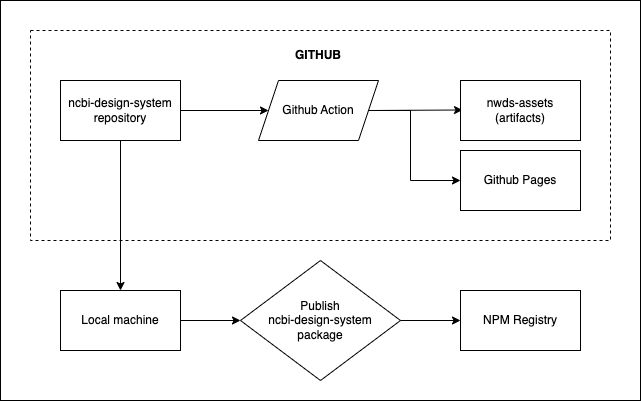

# NCBI Web Design System (NWDS)

This package is a wrapper around [USDWS](https://designsystem.digital.gov/) that adds NCBI theme settings and extends USWDS styles to include custom NCBI components.

- USWDS theme settings are set to NCBI defaults in `/_ncbi-theme.scss`, where the color scheme follows [the NCBI specification](https://www.ncbi.nlm.nih.gov/style-guide/basics/colors/).
- Roboto has been installed as the default font, with NCBI typography styles added in `/_ncbi-typography.scss`.
- Custom components with non-USWDS styles such as the NCBI footer have also been added, see the `/ncbi-components/` folder.

A live demo of all components included in this design package can be accessed at https://ncbi-codeathons.github.io/nds1-team-2-design-package/. (Note that Github Pages deployments need to be active on the `gh-pages` branch for this to be accessible, otherwise this will show a 404)

## Requirements

- Node.js (v16.x.x)
- npm
- USWDS v3

## How to use

These setup steps cover how to install this package in a new web project. There are two available methods of installation:

### Install via direct download

Developers can download all NWDS assets (including CSS, JavaScript, fonts and icons) from the latest release in [the repository releases page](https://github.com/NCBI-Codeathons/nds1-team-2-design-package/releases).

These assets can be added to a webpage in the following manner:

```html
<!DOCTYPE html>
<html lang="en">
  <head>
    <!-- Include meta-tags here -->
    <link rel="stylesheet" href="/assets/css/styles.css" />
    <script src="/assets/js/uswds-init.min.js"></script>
  </head>
  <body>
    <!--
      Include your USWDS components here.
      If they include a reference to an icon which isn't loading, you can update the `src` to the correct asset path.
      Favicons, icons and images can be found in `/assets/img`.
    -->
    <script src="/assets/js/uswds.min.js"></script>
  </body>
</html>
```

### Install via NPM

Installing via NPM with your own build process allows you to create further custom styles on top of NWDS.

First, run `npm install ncbi-design-system @uswds/uswds'

Update your build process so the Sass compiler can find the project SCSS files. Here's an example configuration for WebPack `sass-loader`.

```js
{
  loader: "sass-loader",
  options: {
    sassOptions: {
      includePaths: [
        "./node_modules/@uswds/uswds/packages",
        "./node_modules/ncbi-design-system/src/theme/sass",
      ],
    },
  },
},
```

Next, create an `index.scss` file, the root from which all your project styles will be compiled.

```scss
// Load the USWDS styles with the NCBI theme settings applied.
@forward "ncbi-theme";
@forward "uswds";

// Load extra NCBI specific custom styles and settings
@import "ncbi-settings";
@import "ncbi-typography";

// Load the custom NCBI component styles
@import "ncbi-components/site-alert";
@import "ncbi-components/collection";
```

For documentation on how to modify or add to these styles, please read [the customizing styles documentation](/docs/customizing-styles.md).

Your build process should now be able to compile `index.scss` into the NCBI styles. For an example build process using Webpack, [see the NCBI Django Reference App](https://github.com/NCBI-Codeathons/nds1-team-3-reference-app). This project uses [`uswds-compile`](/gulpfile.js) to build releases with Gulp - this approach will need some adaptation to include the NCBI design system node_module path when compiling the SCSS, as well as updates to `uswds.paths.src` settings.

## Architecture

- This package is built on top of `@uswds/uswds` v3.3.
- `[uswds-compile](https://github.com/uswds/uswds-compile)` builds the releases of this project, compiling SCSS and copying assets.
- Github Actions builds and publishes the release files automatically when code is pushed to `main`. [See the documentation file for information on all GitHub Actions](docs/github-actions.md).
- Version updates are published to NPM manually.



## Contributing to this package

### Getting started with local development

1. First switch to the node version specified in `.nvmrc`. This can be achieved by using a node version management tool such as [`nvm`](https://github.com/nvm-sh/nvm) or [`fnm`](https://github.com/Schniz/fnm).
1. Install the dependencies with `npm install`
1. Run `npm run build` to copy fonts and images into the assets folder. Storybook will reference this folder when rendering.
1. Run `npm run storybook` to display the Storybook instance in your browser.
1. You can then open another terminal instance and run `npm run compile` after you've made changes to the SCSS, or `npm run watch`, which will watch for style changes and rebuild the site automatically. Note that changes can take 5-10 seconds to compile and display.

### Making changes

Override USWDS settings in `/ncbi-theme.scss` or add further custom components in `/ncbi-components`. Make sure to update `styles.scss` with an import to your new component.

You can copy and paste components to `index.html` from the USWDS component library and host the index file locally to see if the styles are loading correctly. Alternatively you can update the storybook template for your component in the `src/stories` folder.

### Commands

- `npm run build` - compiles Sass files and copies other USWDS assets into the `assets` directory.
- `npm run compile` - compiles only SCSS files.
- `npm run watch` - watches the SCSS files for changes and re-compiles on save.
- `npm run format` - formats files with Prettier.
- `npm run lint` - lints files with Stylelint.
- `npm run storybook` - runs the Storybook HTML server locally.
- `npm run deploy-storybook` - compiles the Storybook instance into a static site and pushes it to the `gh-pages` branch.

Refer [uswds-compile functions documentation](https://github.com/uswds/uswds-compile#functions) to understand the role of each function in the `gulpfile.js`.

## Documentation and assets

Documentation is found inside `/docs/` directory and related images should be stored inside `/docs/images/`.

## Team

- James Hancock
  - 4:00 am – 12:30 pm US / 9:00 am - 5:30 pm UK
- Pradeep Chand
  - 9:00 am – 5:00 pm US / 2:00 pm - 10:00 pm UK

Since the team members are working in different timezones, we have agreed upon following work handoff protocol:

- Each developer will work on a feature branch and create a pull request for any completed feature for other developer to review
- Other developer will review the pull request, make necessary changes and merge the changes.
- The other developer will start new work off the merged code base.
